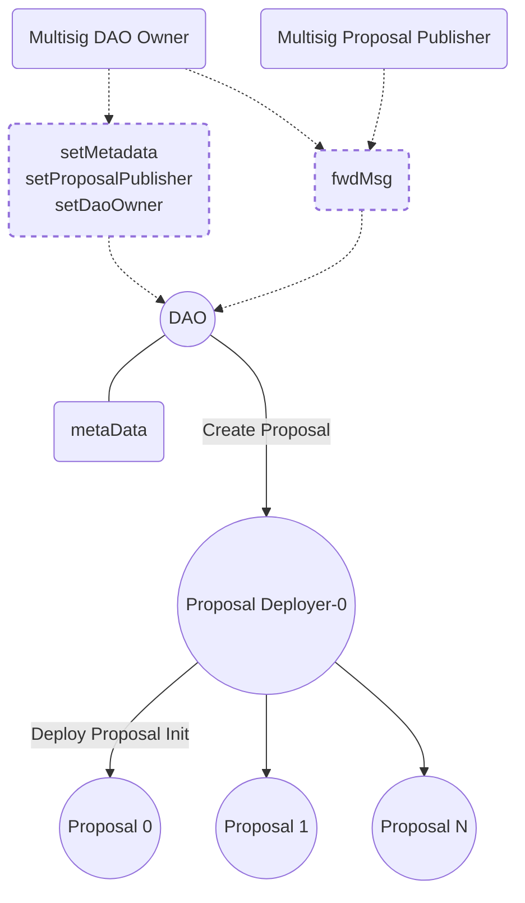

# Vote for The Open Network 
Decentralized DAO Governance for TON

The system architecture is heavily inspired from snapshot.org, the de-facto standard in the EVM ecosystem for DAO governance which is used by Uniswap, Sushi, Aave, Arbitrum, etc.

This repository is dedicated to the Contracts, providing in-depth information about their design considerations and implementation details. The contracts serve as a crucial component of the project, storing essential data about spaces and proposals.

## Architecture

## DAO 
**fwdMsgFee**

The DAO acts as a mediator for forwarding messages to the proposal-deployer responsible for deploying proposals. The fwdMsgFee serves as a mechanism to address potential DDOS attacks.

### Supported messages
* DaoInit- After creating the DAO, a DaoInit message is sent to initialize it with the DAO owner, proposal owner, and metadata. This message is exclusive to the registry that created the DAO. The registry utilizes the Deploy message along with DaoInit when responding to the CreateDao message.
* SetOwner - Utilized by the current owner of the DAO to designate a new owner. It allows the current owner to transfer ownership rights to another owner. The owner is authorized to trnasfer ownership to another owner, set the proposal-owner, set the DAO metadata or send FwdMsg.
* SetProposalOwner - Utilized by the current owner of the DAO to designate a new proposal-owner. It allows the current owner to transfer ownership rights of the proposal-owner to another owner. The proposal-owner is authorized to send FwdMsg which is used to create new proposals.
* SetMetadata - Employed to assign a new Metadata contract to a DAO. The Metadata contract stores essential information about the DAO, while the DAO itself only retains the address of this contract. This architectural design facilitates the upgrade of the Metadata contract while maintaining the integrity and accessibility of the DAO's metadata.
* SetFwdMsgFee - Allows the registry admin to modify the fee associated with forwarding messages. This fee adjustment is implemented to enhance the handling of Distributed Denial of Service (DDoS) attacks. By adjusting the fwdMsg fee, the registry admin can help mitigate the impact of such attacks and ensure the smooth operation of the system.
* FwdMsg - Enables either the owner or the proposal owner to forward messages. This functionality is utilized to create the proposal deployer if it hasn't been deployed yet and to generate new proposals as needed. By utilizing FwdMsg, the owner or proposal owner can manage the deployment and creation of proposals within the system.

## Proposal Deployer
The Proposal Deployer maintains the version of the proposal. It receives messages from the DAO and generates new proposals in response to the 'CreateProposal' message. This contract also keeps track of the total number of proposals deployed under its specific version. Each version of the contract includes all the proposals associated with it.

### Supported messages
1. Deploy - The Deploy message is utilized to establish a new proposal-deployer for a specific DAO. The creation of a new proposal-deployer should be initiated by the owner or the proposal-owner of the DAO by sending a FwdMsg to this contract. Typically, this contract will be created during the first proposal creation and should include both Deploy and CreateProposal mesages.
2. CreateProposal - The CreateProposal message is used to create a new proposal. This message can only be dispatched from the DAO contract by either the owner or the proposal-owner.

## Proposal
The proposal contract encapsulates information about the proposal such as the start time, end time, snapshot time, proposal title and description, voting system, and voting power strategies.

* Voting System - The voting system outlines the proposal choices and how the voting power is distributed among these options. For instance, it can allow for all the voting power to be allocated to one choice, or for the voting power to be distributed across different options based on weight.
* Voting Power Strategy - The voting power strategy defines how a user's vote influences the final proposal results. Different strategies may be required for different proposals based on the specific requirements of each proposal.

### Supported messages
* Deploy - The Deploy message is sent from the proposal-deployer with proposal-deployer address and the proposal id which is a running index managed by the proposal-deployer.
* ProposalInit - The ProposalInit message can only be dispatched from the proposal-deployer (originating from the DAO contract by the owner or the proposal-owner). It encompasses all the metadata of the proposal. Once the proposal parameters are set, they are immutable. This rule is in place to ensure that proposal owners cannot alter the proposal after submission, thereby preventing potential distortion or undue influence on the results.
